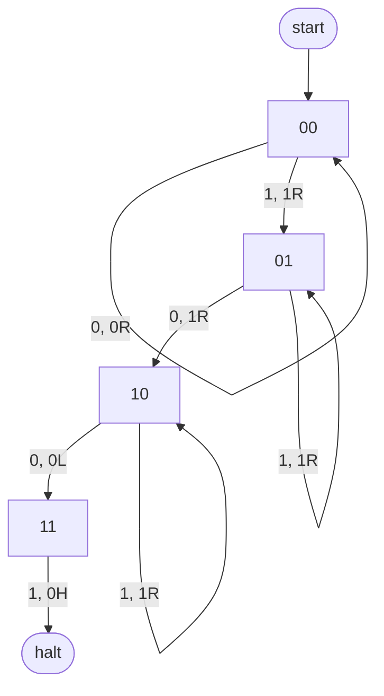

## 流程图

```mermaid
flowchart TD
	start([start]) -->
	00 -- 0, 0R --> 00
	00 -- 1, 1R --> 01
	01 -- 0, 1R --> 10
	01 -- 1, 1R --> 01
	10 -- 0, 0L --> 11
	10 -- 1, 1R --> 10
	11 -- 1, 0H --> halt([halt])
```

## 代码与结果

具体见`turing.v`和`tb_turing.vcd`
